# Generated artwork

These are our project-generated drawings, licensed under [MIT](../LICENSE).
Artists are welcome to inspect, reuse, improve or replace them. See the
[asset notice](../NOTICE.md) for the distinction from Square Enix's original art.

The [inventory](manifest.json) pins every PNG's exact bytes, dimensions and source:

- 675 final native-palette class poses, including the approved Samurai walk fixes.
- 675 extracted source drawings before final native palette conversion.
- Ten portraits, ten standalone head icons and ten miniature source figures.
- Generated axe, impact-effect and status-symbol source images.
- 85 native-palette 16×16 inventory icons for the expansion weapons in
  `items/`, pinned by the [approval receipt](../src/art/imagegen/new-item-icons-approved.json).

`characters/<class>/native-pose/` contains the accepted final pose inputs.
`source-pose/` contains the earlier generated drawings; the four later Samurai
walk corrections are in `native-pose/`. Detailed prompts, pose bindings and
review history are in [the source catalogs](../src/art/race-study/full-animation-v1).
The [round8 approval](../src/art/native-ui-review/approved-round8.json) records
the final menu graphics and walk corrections. Those records retain historical
development paths; the public inventory maps them to the included files.

## Excluded material

Original game sprites, mixed reference worksheets, complete UI frames, native
lettering, screenshots, ROMs and third-party concept images are excluded.
We include isolated generated results; head icons exclude their game badges.
The three larger source images have only ancillary Content Credentials metadata
removed, with compressed image data unchanged. Their original source hashes and
the metadata removal are recorded; original files remain in the local archive.

[The exporter](../scripts/export-generated-artwork.py) authenticates source
hashes and dimensions and refuses to replace different files. CI and the Git
guard reject unlisted PNGs, altered bytes, unexpected dimensions and unreviewed
embedded metadata. No reference images are required to view these PNGs.

## Class examples

| Class | Sprite | Portrait |
|---|---|---|
| Human Samurai | 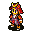 | 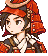 |
| Human Dark Knight | 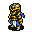 | 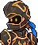 |
| Bangaa Viking | 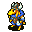 | 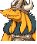 |
| Bangaa Dark Knight | 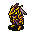 | 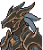 |
| Nu Mou Chemist | 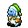 | 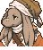 |
| Nu Mou Geomancer | 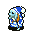 | 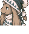 |
| Moogle Chemist | 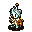 | 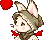 |
| Moogle Bard | 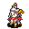 | 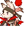 |
| Viera Dancer | 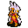 | 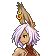 |
| Viera Mystic Knight | 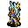 | 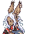 |
